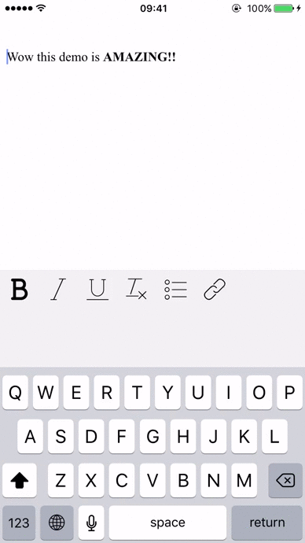

[](https://badge.fury.io/js/react-native-richtext-editor)

# react-native-richtext-editor
A Flexible Rich Text Editor for React Native.

**This library currently supports iOS only**

### Demo


Install
--------------

```npm install react-native-richtext-editor --save```

Usage
--------------
It is strongly recommended to go through the Example project attached to this repo.

In order to add both the editor and its toolbar separately, add these requires to your code:
```
var HBRichTextEditor = require('react-native-richtext-editor');
var HBToolbar = require('react-native-richtext-editor/HBToolbar');
```

- In your render method, add the components like this:
```
<HBRichTextEditor
                ref="myEditor"
                initialHTML={bodyForDisplay}/>
<HBToolbar />
```

HBRichTextEditor Props Configuration
--------------
- **initialHTML** : an HTML string to be displayed as the initial value in the editor.

HBToolbar Props Configuration
--------------
- **toolbarItems** : There is a default toolbar preset. If you don't want the default one, you can pass 'toolbarItems' which should be an array of string constants, reflecting the items that should appear in the toolbar. The supported toolbar items appear on HBEditorConstants file (under "Button Types").
- **baseButtonStyle** : Styling that should be applied to all buttons in the toolbar - regardless of the button's state.
- **defaultButtonStyle** : Styling that should be applied to all **unselected** buttons in the toolbar.
- **selectedButtonStyle** : Styling that should be applied to all **selected** buttons in the toolbar.

Events emitted from the editor
--------------
- **HBEditorConstants.HB_RICH_EDITOR_GOT_FOCUS** : Will fire when the editor gets focus, to give you an option of preparing the view.
- **HBEditorConstants.HB_RICH_EDITOR_TOOLBAR_BUTTON_WAS_PRESSED** : Will fire every time a toolbar button has been pressed. As a payload you'll get "pressedButton" - the specific name of the button that was pressed.

TODOs
--------------
- Android Support
- Improve link creation on editor.
- Take out the 1000ms timeout when initing the editor.
- Support <Input> tags parsing.
- Add ability to change icons of buttons.
- ...

Attribution
--------------

`react-native-richtext-editor` uses portions of code from the following sources:

| Component     | Description   | License  |
| :------------- |:-------------| :-----|
| [ZSSRichTextEditor](https://github.com/nnhubbard/ZSSRichTextEditor)      | A beautiful rich text WYSIWYG editor for iOS with a syntax highlighted source view | [MIT](https://github.com/nnhubbard/ZSSRichTextEditor/blob/master/LICENSE.txt) |
| [jQuery](https://jquery.com)      | jQuery is a fast, small, and feature-rich JavaScript library.      |   [MIT](http://jquery.org/license) |
| [RN Webview Bridge](react-native-webview-bridge)      | React Native Webview with Javascript Bridge      |   [MIT](https://github.com/alinz/react-native-webview-bridge/blob/master/LICENSE) |

Contact
--------------
Visit us online at [http://www.honeybook.com](http://www.honeybook.com) or contact me directly at [@guyeldar](https://twitter.com/guyeldar).

License
----
BSD 3-Clause
